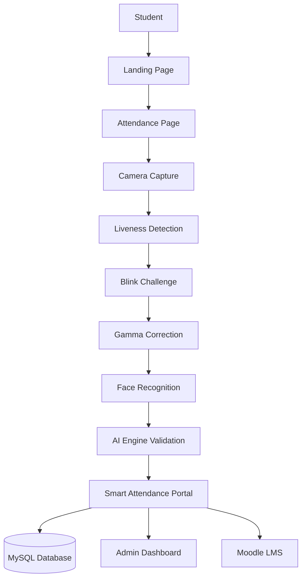
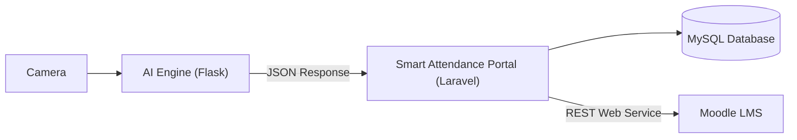

# 🎓 Integrated Smart Attendance System
# Scroll down to the **Admin Account** section for the login credentials

## Integration of an E-Learning Attendance System Using a Microservice Architecture Based on Camera and Face Recognition


---

## 📖 Project Overview

This project presents an integrated smart attendance system that combines Artificial Intelligence (AI), web technologies, and e-learning services using a microservice architecture. The system is designed to perform real-time attendance verification through face recognition while preventing spoofing attempts using liveness detection techniques.

Unlike a conventional attendance system, this solution separates AI processing from business logic, allowing each service to operate independently while communicating through RESTful APIs.

After successful face verification, attendance information is automatically processed by the Laravel web application, stored in the local MySQL database, displayed on the administration dashboard, and synchronized with Moodle LMS using Moodle Web Services.

The project consists of three interconnected components:

- 🤖 **AI Engine (Flask)** — Responsible for face detection, liveness verification, image preprocessing, and face recognition.
- 🌐 **Smart Attendance Portal (Laravel)** — Handles business logic, attendance management, user interface, and acts as the API Gateway between services.
- 🎓 **Moodle LMS** — Receives user and attendance synchronization through Moodle REST Web Services.

---

# 🎯 Project Objectives

The primary objective of this project is to develop an integrated attendance system capable of performing secure facial authentication using computer vision and artificial intelligence technologies while automatically synchronizing attendance information with an e-learning platform.

The system aims to:

- Improve attendance accuracy using Face Recognition.
- Prevent spoofing attempts using Liveness Detection.
- Automate attendance synchronization with Moodle LMS.
- Separate AI processing from business logic using a Microservice Architecture.
- Provide a scalable and maintainable attendance platform.

---

# ✨ Key Features

- 📷 Real-time Face Recognition
- 👁️ Liveness Detection
- 😉 Blink Challenge Verification
- 💡 Gamma Correction for Low-Light Conditions
- 🧠 AI-based Face Validation
- 📊 Attendance Management Dashboard
- 👥 Student Face Registration
- 📚 Automatic Moodle User Synchronization
- 🔄 REST API Communication Between Services
- 🗄️ Attendance History Logging
- 🔒 Secure Moodle Authentication using Web Service Token

---

# 🏛️ System Workflow

The attendance process follows the sequence below:



The workflow begins when a student accesses the attendance page from the landing page. The AI Engine performs several computer vision processes including liveness verification, blink challenge validation, image enhancement using gamma correction, and face recognition.

Once the face has been successfully recognized, the AI Engine returns a JSON response to the Smart Attendance Portal. The web application then records attendance in the local database, updates the administration dashboard, and synchronizes the attendance information with Moodle LMS.

---

# 🔗 Microservice Architecture

The project adopts a microservice architecture where each component has its own responsibility.



### AI Engine

The AI Engine is implemented using Python and Flask. It is responsible for:

- Image preprocessing
- Face Detection
- Gamma Correction
- Blink Challenge
- Liveness Detection
- Face Recognition
- Returning recognition results as JSON responses

### Smart Attendance Portal

The Laravel application functions as:

- API Gateway
- Business Logic Layer
- Attendance Management
- Database Management
- Moodle Integration
- Administration Dashboard

### Moodle LMS

Moodle acts as the e-learning platform. After successful attendance validation, the Laravel application communicates with Moodle through REST Web Services using authentication tokens to synchronize user and attendance information.

---

# 🛠️ Technology Stack

| Category | Technology |
|-----------|------------|
| Backend Framework | Laravel 12 |
| Programming Language | PHP 8.2 |
| AI Engine | Flask |
| AI Framework | DeepFace |
| Computer Vision | OpenCV |
| Face Detection | RetinaFace, MTCNN |
| Machine Learning | TensorFlow, PyTorch |
| Frontend | Blade, Tailwind CSS 4 |
| Build Tool | Vite |
| Database | MySQL |
| E-Learning | Moodle LMS |
| Communication | REST API (JSON) |

---

# 📂 Repository Structure

```text
TA-integrasi-sistem-presensi-face-recognition/

├── engine-ai/
│   ├── app_api.py
│   ├── registrasi.py
│   ├── presensi.py
│   ├── daftar_wajah.py
│   ├── requirements.txt
│   ├── presensi_log/
│   └── ...
│
├── smart-attendance-portal/
│   ├── app/
│   ├── bootstrap/
│   ├── config/
│   ├── database/
│   ├── public/
│   ├── resources/
│   ├── routes/
│   ├── composer.json
│   ├── package.json
│   └── ...
│
└── README.md
```

---

## 📌 Core Components

| Component | Description |
|-----------|-------------|
| AI Engine | Handles all computer vision and face recognition processes. |
| Smart Attendance Portal | Manages attendance workflow, database, dashboard, and API Gateway. |
| Moodle LMS | Provides e-learning services and receives synchronized attendance data. |

---
# 🚀 Installation Guide

This project consists of two independent services:

- **Smart Attendance Portal (Laravel)**
- **AI Engine (Flask)**

Both services must be configured before the system can be used.

---

## 📋 Prerequisites

Before running the project, make sure the following software is installed:

| Software | Version |
|----------|---------|
| PHP | 8.2 or later |
| Composer | Latest |
| Node.js | Latest LTS |
| Python | 3.x |
| MySQL | 8.x |
| Git | Latest |
| Moodle LMS | 4.x |

---

# 1️⃣ Clone Repository

```bash
git clone https://github.com/RajaUlka/TA-integrasi-sistem-presensi-face-recognition.git
cd TA-integrasi-sistem-presensi-face-recognition
```

---

# 2️⃣ Setup Smart Attendance Portal

Navigate to the Laravel project.

```bash
cd smart-attendance-portal
```

Install PHP dependencies.

```bash
composer install
```

Install frontend dependencies.

```bash
npm install
```

Copy environment configuration.

```bash
cp .env.example .env
```

Generate Laravel application key.

```bash
php artisan key:generate
```

Configure the database connection inside the `.env` file.

Example:

```env
DB_CONNECTION=mysql
DB_HOST=127.0.0.1
DB_PORT=3306
DB_DATABASE=db_presensi_ta
DB_USERNAME=root
DB_PASSWORD=
```

Run database migration (if applicable).

```bash
php artisan migrate
```

Start the development server.

```bash
php artisan serve
```

---

# 3️⃣ Setup AI Engine

Open another terminal.

```bash
cd engine-ai
```

Create a Python virtual environment.

```bash
python -m venv venv
```

Activate the virtual environment.

Windows

```bash
venv\Scripts\activate
```

Linux / macOS

```bash
source venv/bin/activate
```

Install Python dependencies.

```bash
pip install -r requirements.txt
```

Run the AI Engine.

```bash
python app_api.py
```

---

# 4️⃣ Configure Moodle

Enable Moodle Web Services.

Generate a Web Service Token.

Configure the following variables inside Laravel's `.env` file:

- Moodle URL
- Web Service Token
- Required REST API Functions

After configuration is complete, Laravel will automatically synchronize attendance records and user information with Moodle LMS.


# 📡 API Communication

The system uses RESTful API communication between each service.

## AI Engine → Smart Attendance Portal

After face recognition is completed, the AI Engine returns a JSON response to the Laravel application.

Example response:

```json
{
    "status": "success",
    "message": "Face recognized successfully",
    "data": {
        "nim": "3312311128",
        "name": "Student Name",
        "confidence_score": 0.95,
        "timestamp": "2026-07-25 08:30:00"
    }
}
```

The Laravel application processes this response by:

- Recording attendance in MySQL.
- Updating the administration dashboard.
- Synchronizing attendance with Moodle LMS.


# 🤖 AI Processing Pipeline

Before attendance is confirmed, every captured image passes through several computer vision processes.

```text
Camera Capture
      │
      ▼
Gamma Correction
      │
      ▼
Face Detection
      │
      ▼
Blink Challenge
      │
      ▼
Liveness Detection
      │
      ▼
Face Recognition
      │
      ▼
JSON Response
```

This pipeline improves recognition accuracy while reducing spoofing attempts using printed photographs or static images.

# 📸 Screenshots

| Feature | Preview |
|----------|---------|
| Landing Page | *(Add Screenshot)* |
| Attendance Page | *(Add Screenshot)* |
| Face Registration | *(Add Screenshot)* |
| Admin Dashboard | *(Add Screenshot)* |


# ⚠️ Notes

- The AI Engine must be running before attendance can be performed.
- Moodle synchronization requires a valid Web Service Token.
- Python dependencies are managed using `requirements.txt`.
- Laravel dependencies are managed using Composer and NPM.
- The `venv` directory is intentionally excluded from the repository because it can be recreated using `requirements.txt`.


# 👨‍💻 Author

**Raja Ulka Teta Raflifasya**

Final Project (Diploma III)

Department of Informatics Engineering

Politeknik Negeri Batam

Indonesia

# Admin account
id= admin
password = admin123